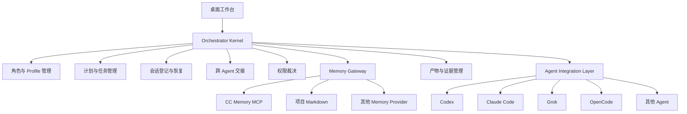
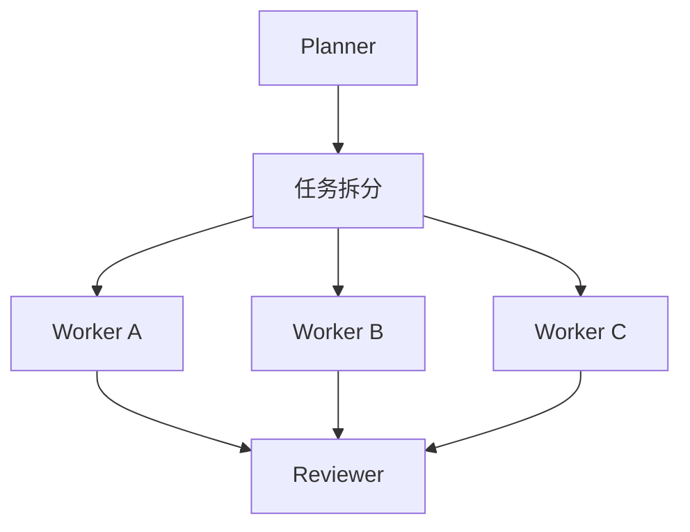

# 本地优先的可插拔多 Agent 项目工作台  
## 产品与系统设计提案

**文档版本：** v0.1  
**文档性质：** 产品设计与系统理论提案  
**讨论范围：** 产品定位、角色关系、Agent 接入、计划与任务、会话连续性、项目记忆、权限治理、用户交互与参考项目  
**不讨论内容：** 具体技术栈、代码结构、数据库表设计、开发排期和实现成本

---

# 1. 文档摘要

本项目希望设计一个类似 Codex 桌面端工作流、但不绑定任何单一 AI 的本地工作台。

用户可以自由指定不同 AI 承担不同角色，例如：

```text
今天：
Codex 负责讨论与规划
Claude Code 负责执行

明天：
Grok 负责讨论与规划
Codex 负责执行

之后：
Claude Code 负责规划
Codex 负责执行
Grok 负责审查
```

系统不应把 Codex、Claude、Grok 写死在工作流中，而应将它们视为随时可以替换的 Agent。

整个产品的核心不是“同时打开很多 AI 终端”，而是维护以下内容：

```text
项目状态
角色关系
计划版本
任务状态
执行结果
项目记忆
权限边界
跨 Agent 交接
会话恢复
修改证据
```

本项目的核心定义是：

> 一个本地优先、厂商无关、可插拔的多 Agent 项目控制平面。

它不拥有模型能力，也不重新实现 Codex、Claude Code 或 Grok，而是负责组织、约束和连接这些 Agent。

---

# 2. 核心命题

整个设计建立在以下命题上：

```text
项目状态不等于 AI 会话。

项目状态
=
计划
+ 任务
+ 决策
+ 记忆
+ 产物
+ 执行记录
+ 权限记录
```

AI 会话只是参与项目的一种临时工作环境。

因此：

```text
角色是稳定的
Agent 是可替换的
Provider 是可配置的
会话属于具体 Agent
记忆属于项目
计划属于项目
任务属于项目
执行证据属于项目
```

即使 Codex 被替换成 Grok，或者 Claude Code 被替换成 Codex，项目本身仍然应该保持连续。

---

# 3. 产品定位

本产品不应被定义为：

```text
缩小版 Codex
精简版 CC-Panes
多 AI 终端分屏工具
AI CLI 启动器
模型 API 聚合平台
```

更准确的定位是：

> 一个用于管理多 Agent 项目工作的本地桌面工作台。

它负责：

- 让用户与规划 Agent 讨论项目；
- 将自由讨论整理为正式计划；
- 将计划拆分为可执行任务；
- 将任务交给不同执行 Agent；
- 限制执行 Agent 的权限范围；
- 收集文件修改、测试和执行报告；
- 将结果交给规划 Agent、审查 Agent或用户；
- 保存项目记忆；
- 在更换 Agent 时迁移必要上下文；
- 在软件重启后恢复或重建工作状态。

---

# 4. 产品要解决的问题

## 4.1 AI 被固定在工作流中

现有工作流经常隐含以下关系：

```text
Codex = 主 AI
Claude Code = 子 AI
```

当用户想改成：

```text
Grok = 主 AI
Codex = 子 AI
```

往往需要重新复制上下文、重新解释项目、重新设计调用方式。

本产品应把关系改成：

```text
Planner Role
Worker Role
Reviewer Role
```

然后由用户自由选择：

```text
Planner Role → 任意 Planner Profile
Worker Role → 任意 Worker Profile
Reviewer Role → 任意 Reviewer Profile
```

工作流不随 AI 品牌改变。

---

## 4.2 对话不能直接成为项目状态

一段对话中可能同时存在：

- 用户最初的要求；
- 后续补充；
- 被否定的方案；
- AI 的临时推测；
- 尚未确认的假设；
- 已批准的决定；
- 执行结果；
- 遗留问题。

因此，聊天记录不能直接被视为项目真相。

系统需要把对话逐步转化为：

```text
自由讨论
    ↓
计划草案
    ↓
已批准计划
    ↓
任务合同
    ↓
执行结果
    ↓
审查结果
    ↓
正式项目记忆
```

---

## 4.3 不同 Agent 无法真正共享原生会话

Codex 的会话 ID 只对 Codex 有意义。

Claude Code 的会话 ID 只对 Claude Code 有意义。

Grok 的会话状态也无法被其他 Agent 原样理解。

因此：

```text
Codex → Codex
```

可以称为原生恢复。

但：

```text
Codex → Grok
```

不能称为恢复同一个会话，只能称为：

```text
跨 Agent 上下文迁移
```

系统需要建立独立于 Agent 的项目状态，并通过标准交接包将必要信息传递给新的 Agent。

---

## 4.4 项目知识被锁在某个 AI 中

项目中真正重要的信息通常包括：

- 为什么选择当前架构；
- 哪些方案已经被否定；
- 当前有哪些限制；
- 哪些目录不能修改；
- 测试应该如何运行；
- 某些问题曾经为什么失败；
- 当前计划执行到哪里；
- 用户已经确认了哪些偏好。

这些内容不能只存在于某个 Codex Thread 或 Claude Session 中。

它们应该被保存在独立的项目记忆系统中，并可以被不同 Agent 读取。

---

## 4.5 Agent 权限过大且不透明

规划 Agent 通常只需要读取项目和讨论方案，不一定需要写文件。

执行 Agent 即使可以修改代码，也不应默认拥有：

- 修改整个项目的权限；
- 删除项目记忆的权限；
- 读取其他项目的权限；
- 读取凭证的权限；
- 执行任意外部命令的权限；
- Git Push 权限；
- 发布和部署权限。

权限应跟随角色和任务，而不是跟随 AI 品牌。

---

# 5. 设计目标

## 5.1 主要目标

| 目标 | 说明 |
|---|---|
| Agent 可替换 | Planner、Worker、Reviewer 均可绑定不同 AI |
| 项目状态本地化 | 计划、任务、记忆和记录不依赖某个 AI |
| 支持跨 Agent 迁移 | 更换 AI 后通过交接包继续工作 |
| 共享项目记忆 | 不同 Agent 可以读取同一套项目知识 |
| 权限清晰 | 用户知道 Agent 能读、能写、能执行什么 |
| 结果可验证 | 任务完成必须有文件、测试或报告证据 |
| 支持能力降级 | 新 Agent 即使功能有限，也可以基础接入 |
| 核心保持简单 | 终端、Provider、Memory、Agent 兼容通过外部模块解决 |
| 用户保持控制权 | 计划批准、权限扩展和正式记忆由用户控制 |

---

## 5.2 非目标

本项目不以以下内容为核心目标：

```text
不重新训练模型
不提供模型转售
不替代 Git
不成为完整终端复用器
不保证不同 AI 产生完全相同的结果
不默认允许无限递归子 Agent
不自动把所有聊天写入长期记忆
不把跨 Agent 迁移伪装成原生恢复
不允许 Agent 在用户不可见时无限互聊
不默认让多个 Worker 同时修改同一批文件
不默认执行自动发布或生产部署
```

---

# 6. 核心设计原则

## 6.1 按角色设计，不按品牌设计

系统中的稳定对象应当是：

```text
Planner
Worker
Reviewer
Researcher
Memory Curator
```

而不是：

```text
Codex
Claude
Grok
```

示例：

```text
Planner  = Grok
Worker   = Codex
Reviewer = Claude Code
```

第二天可以变成：

```text
Planner  = Claude Code
Worker   = Grok
Reviewer = Codex
```

角色职责不变，只替换角色所绑定的 Agent Profile。

---

## 6.2 计划是工作合同，不是聊天摘要

计划不只是对聊天内容的概括。

一份可以交给另一个 Agent 执行的计划，需要包含：

```text
目标
范围
非目标
约束
假设
已确认决策
验收标准
任务关系
风险
验证方式
回退方式
```

只有被用户批准的计划，才成为正式执行依据。

计划必须版本化：

```text
Plan v1
Plan v2
Plan v3
```

执行结果必须明确自己基于哪个计划版本。

---

## 6.3 Planner 不直接操作 Worker 的终端

不建议采用以下方式：

```text
Planner 向 Worker 的终端输入文字
Planner 读取 Worker 的终端画面
Planner 判断 Worker 是否已经完成
Planner 再继续向终端输入
```

这种方式会让产品逐渐变成一个复杂的终端自动化系统。

推荐关系是：

```text
Planner
    ↓ 形成计划和任务
Orchestrator
    ↓ 启动指定 Worker
Worker
    ↓ 返回执行报告与产物
Orchestrator
    ↓ 提交给 Planner、Reviewer 或用户
```

Agent 之间传递的是结构化任务和产物，而不是模拟键盘操作。

---

## 6.4 本地工作台拥有项目真实状态

Agent 可以提出：

- 计划草案；
- 新任务；
- 任务完成声明；
- 记忆候选；
- 权限扩展请求。

但最终项目状态由本地工作台保存。

例如，Worker 声称“测试通过”，不自动等于任务完成。

任务完成应尽量包含：

```text
Worker 完成报告
文件修改记录
测试执行记录
验收标准核对
Reviewer 或用户确认
```

---

## 6.5 通过能力声明判断 Agent

系统不应写成：

```text
Codex 支持恢复
Claude 支持执行
Grok 支持规划
```

而应由每个 Agent Profile 声明能力：

```text
是否支持流式输出
是否支持结构化事件
是否支持原生恢复
是否支持会话分支
是否支持文件读取
是否支持文件修改
是否支持 Shell
是否支持审批
是否支持 MCP
是否支持 ACP
是否支持结构化输出
是否支持任务取消
是否支持 Diff 事件
是否支持测试事件
```

工作流只关心能力是否满足，不关心 Agent 的品牌。

---

## 6.6 跨 Agent 使用交接，不使用伪恢复

恢复分为三种：

```text
同 Agent，且支持原生会话
= 原生恢复

同 Agent，但不支持原生会话
= 上下文重建

不同 Agent
= 跨 Agent 迁移
```

用户界面必须明确区分：

```text
原生恢复
上下文重建
跨 Agent 迁移
```

---

## 6.7 记忆属于项目

Agent 可以读取记忆、引用记忆和提出记忆候选。

但记忆不属于某个 Agent。

项目记忆应当满足：

```text
用户可查看
用户可修改
来源可追踪
可以导出
可以迁移
可以被多个 Agent 查询
不会因为卸载某个 AI 而消失
```

---

## 6.8 委派不能自动扩大权限

Planner 能读取整个项目，不代表 Worker 自动获得同样权限。

Worker 的最终权限应为以下条件的交集：

```text
项目总策略
∩ 角色默认权限
∩ Agent Profile 权限
∩ 当前任务权限
∩ 用户临时批准
```

任何 Agent 都不能自行批准自己的权限扩展。

---

# 7. 核心概念模型

## 7.1 Project

Project 是整个系统最重要的边界。

Project 拥有：

```text
项目路径
项目标识
项目说明
当前计划
历史计划
任务状态
项目记忆
默认角色配置
权限策略
会话引用
执行产物
事件历史
```

Project 不一定等于一个 Git 仓库，也可以绑定多个仓库或多个目录。

---

## 7.2 Role

Role 表示职责，不表示具体模型。

建议默认角色如下：

| 角色 | 主要职责 | 默认权限 |
|---|---|---|
| Planner | 与用户讨论、分析并形成计划 | 项目只读 |
| Worker | 执行受约束的任务 | 指定范围可写 |
| Reviewer | 对照计划和验收标准审查结果 | 项目与 Diff 只读 |
| Researcher | 搜索资料、比较方案 | 网络与项目只读 |
| Memory Curator | 整理、确认和维护项目记忆 | 记忆候选与审核权限 |

用户还可以创建自定义角色，例如：

```text
UI Designer
Test Worker
Security Reviewer
Documentation Worker
Build Engineer
Game Design Reviewer
```

---

## 7.3 Agent Runtime

Agent Runtime 表示实际运行的 Agent 产品，例如：

```text
Codex
Claude Code
Grok
OpenCode
Goose
Aider
自定义 CLI Agent
远程 Agent 服务
```

Agent Runtime 负责自己的：

```text
会话
推理
工具调用
文件操作
Shell 操作
原生恢复
原生审批
```

---

## 7.4 Model Provider

Provider 表示模型来源、认证方式或模型服务，例如：

```text
OpenAI
Anthropic
xAI
OpenRouter
Azure
Bedrock
Vertex AI
本地模型服务
CLI 自身登录状态
```

Provider 和 Agent Runtime 必须分开。

同一个 Agent Runtime 可能支持多个 Provider。

同一个 Provider 也可能被多个 Runtime 使用。

---

## 7.5 Agent Profile

Agent Profile 是用户实际选择的完整运行配置。

```text
Agent Profile
=
Agent Runtime
+ Provider
+ Model
+ 登录方式
+ 权限策略
+ MCP 工具集
+ 记忆策略
+ 会话恢复策略
+ 角色提示规则
```

示例：

```text
Profile: grok-planner

Runtime: Grok
Role Default: Planner
Permission: Project Read Only
Memory: Project Read
Tools: Search + File Read
```

另一个示例：

```text
Profile: codex-worker

Runtime: Codex
Role Default: Worker
Permission: Scoped Workspace Write
Memory: Project Read
Tools: Shell + Git + Test
```

---

## 7.6 Session

Session 表示某个 Agent Profile 的一次连续工作会话。

需要区分：

```text
Local Session ID
Agent Runtime ID
Native Session ID
Process ID
```

其中：

- Local Session ID 由本地工作台维护；
- Native Session ID 属于具体 Agent；
- Process ID 只代表当前运行进程；
- Process ID 不能用来代表长期会话。

---

## 7.7 Plan

Plan 是经过讨论和确认的项目行动方案。

计划应支持：

```text
draft
approved
paused
superseded
completed
cancelled
```

每次重要修改都应生成新版本，而不是覆盖旧版本。

---

## 7.8 Task

Task 是从计划中产生的有限责任工作单元。

一项任务应明确：

```text
目标
范围
允许读取的内容
允许修改的内容
禁止事项
依赖任务
相关记忆
预期产物
验收标准
验证方法
```

---

## 7.9 Run

同一个 Task 可能被执行多次：

```text
Task A
├── Run 1：失败
├── Run 2：被中断
└── Run 3：完成
```

因此 Task 和 Run 必须是两个不同概念。

Task 表示要做什么。

Run 表示某个 Agent 的一次实际尝试。

---

## 7.10 Artifact

Artifact 是 Agent 产生的可保存结果，例如：

```text
计划
任务合同
代码 Diff
修改文件列表
测试报告
审查报告
设计文档
日志摘要
问题说明
交接包
记忆候选
```

Agent 之间主要通过 Artifact 交流，而不是传递完整聊天记录。

---

## 7.11 Handoff

Handoff 是跨 Agent 迁移时使用的标准交接对象。

它应包含：

```text
项目目标
当前计划版本
已完成任务
正在进行的任务
待执行任务
已确认决策
相关项目记忆
当前文件变化
测试状态
阻塞问题
未解决问题
权限范围
接收方预期输出
```

Handoff 不需要复制完整终端日志，也不需要包含无关聊天。

---

# 8. 概念架构



核心系统只负责：

```text
Project
Role
Agent Profile
Plan
Task
Run
Session Registry
Artifact
Handoff
Memory Gateway
Permission Policy
Event Ledger
```

Agent、Provider、Memory、MCP、终端和远程服务都应尽量通过外部模块接入。

---

# 9. Agent 接入设计

## 9.1 接入等级

不同 Agent 支持的能力并不一致。

建议定义以下接入等级。

### A 级：深度原生接入

特点：

```text
结构化事件
原生会话
原生恢复
审批事件
文件修改事件
命令事件
任务取消
```

适合拥有专门 SDK、Server 或 App Protocol 的 Agent。

---

### B 级：标准 Agent 协议接入

特点：

```text
支持 ACP 或其他标准协议
具备会话和事件
部分能力可能缺失
```

这是未来较理想的通用接入方式。

---

### C 级：结构化 CLI 接入

特点：

```text
通过命令行启动
可以使用无头模式
支持 JSON、JSONL 或明确的结构化输出
可能不支持完整会话恢复
```

---

### D 级：单次命令接入

特点：

```text
传入任务
运行一次
收集最终结果
结束进程
```

适合简单 Agent 或临时工具。

---

### E 级：PTY 兼容接入

特点：

```text
只能通过交互式终端使用
需要读取终端输出
需要模拟用户输入
状态判断不稳定
```

PTY 应作为最后的兼容方式，而不是核心设计。

---

## 9.2 Adapter 与配置型接入

系统应同时支持两类接入。

### 专用 Adapter

适用于：

```text
Codex Adapter
Claude Code Adapter
Grok Adapter
ACP Adapter
```

它们负责复杂会话、事件、审批和恢复。

### 配置型 Adapter

适用于普通 CLI。

用户只需要配置：

```text
启动命令
参数
工作目录
环境变量
输入方式
输出方式
能力声明
恢复方式
```

这样新 AI 出现后，即使尚未开发专用 Adapter，也能先以基础模式接入。

---

# 10. ACP、MCP 与 A2A 的职责划分

这三个概念不应混淆。

## 10.1 ACP

ACP 用于：

```text
桌面工作台如何连接编程 Agent
```

它解决：

- 会话建立；
- 用户提示；
- Agent 输出；
- 权限请求；
- 会话状态更新；
- 客户端和 Agent 能力协商。

---

## 10.2 MCP

MCP 用于：

```text
Agent 或工作台如何连接工具、资源和记忆
```

它可以连接：

```text
项目记忆
搜索服务
Git 工具
测试工具
文档系统
文件资源
外部数据
```

MCP 不负责替代 Agent 会话协议。

---

## 10.3 A2A

A2A 更适合未来用于：

```text
独立远程 Agent 服务之间的协作
```

例如：

```text
本地工作台
    ↓
远程安全审查 Agent
    ↓
企业内部构建 Agent
```

第一阶段的本地 Planner—Worker 工作流不需要立即引入 A2A。

---

# 11. 标准工作流

## 11.1 自由讨论

用户与 Planner 讨论：

```text
目标
约束
路线
风险
架构
替代方案
```

这一阶段允许内容反复变化。

Planner 默认只读，不直接修改项目。

---

## 11.2 形成计划

用户明确要求形成计划后，Planner 输出计划草案。

计划至少包含：

```text
目标
背景
范围
非目标
约束
已确认决策
未确认假设
任务拆分
依赖关系
验收标准
风险
验证方法
```

---

## 11.3 批准计划

用户可以：

```text
修改计划
删除任务
调整顺序
修改 Agent
限制路径
增加验收标准
冻结部分内容
标记未确认问题
```

批准后生成正式版本：

```text
Plan v3 — Approved
```

后续修改应创建 Plan v4，而不是静默覆盖 Plan v3。

---

## 11.4 生成任务合同

Worker 不接收 Planner 的全部聊天记录。

Worker 接收有限的任务合同：

```text
任务目标
计划版本
允许修改范围
禁止事项
依赖结果
相关记忆
验收标准
验证命令
预期产物
权限范围
```

---

## 11.5 Worker 执行

任务状态可以为：

```text
draft
approved
queued
running
waiting_user
blocked
failed
cancelled
completed
```

Worker 执行过程中可以提交：

```text
权限扩展请求
澄清请求
阻塞报告
中间产物
最终报告
```

---

## 11.6 Reviewer 审查

Reviewer 应逐项检查：

```text
是否满足目标
是否越过范围
是否违反约束
验收标准是否有证据
测试是否真实执行
是否产生意外文件修改
是否引入新的风险
是否需要重新规划
```

Reviewer 不应只根据 Worker 的一句“已完成”做判断。

---

## 11.7 用户接受或重新规划

执行结果最终可以进入：

```text
接受
要求修复
重新执行
重新规划
放弃任务
```

---

## 11.8 记忆沉淀

任务结束后，系统可以生成记忆候选，例如：

```text
确认过的架构决定
发现的项目规则
失败原因
特殊测试命令
容易重复踩到的问题
用户明确确认的偏好
```

记忆候选不能自动成为正式记忆。

---

# 12. 多 Agent 协作关系

## 12.1 推荐的默认关系


---

## 12.2 多 Worker

允许多个 Worker 时：



只有满足以下条件时才建议并行：

```text
任务目标相互独立
文件修改范围不重叠
依赖关系明确
产物可以独立验证
冲突时存在合并规则
```

默认应优先保证可靠性，而不是追求并发数量。

---

## 12.3 不默认允许 Agent 自由互聊

不推荐以下模式：

```text
Planner 与 Worker 无限对话
Worker 再创建 Worker
子 Worker 再创建 Reviewer
Agent 自己决定何时结束
```

这会带来：

```text
目标漂移
成本失控
权限扩散
重复工作
上下文污染
责任不清
用户不可理解
```

推荐使用标准消息和产物：

```text
Task
Question
Clarification Request
Permission Request
Report
Review
Handoff
Memory Candidate
```

---

# 13. 澄清请求设计

Worker 遇到问题时，不应私下与 Planner 无限对话。

它应提交结构化澄清请求：

```text
问题：
当前接口是否必须兼容旧版本？

影响：
若需要兼容，需要额外修改两个文件。

可选方案：
A. 保持兼容
B. 仅支持新接口

建议：
选择 A。

需要的额外权限：
读取旧版本兼容模块。
```

由用户或 Planner 回答后继续执行。

---

# 14. 会话恢复设计

## 14.1 原生恢复

适用于：

```text
同一个 Agent
并且 Agent 支持原生 Session Resume
```

系统保存：

```text
Local Session ID
Native Session ID
Agent Profile
项目
角色
最后状态
```

恢复时重新连接原生会话。

---

## 14.2 上下文重建

当 Agent 不支持原生恢复时：

```text
本地事件摘要
+ 当前计划
+ 当前任务
+ 相关记忆
+ 最近产物
+ 阻塞问题
    ↓
创建新会话
```

用户界面应显示：

> 这是根据项目状态重建的新会话，不是原生会话恢复。

---

## 14.3 跨 Agent 迁移

例如：

```text
Codex Planner
    ↓
切换为
Grok Planner
```

迁移过程：

```text
提取当前项目状态
    ↓
生成 Handoff
    ↓
检索相关项目记忆
    ↓
用户查看交接内容
    ↓
创建新的 Grok Session
    ↓
注入交接包
```

用户应看到：

```text
来源 Agent
目标 Agent
当前计划版本
将传递哪些内容
不会传递哪些内容
目标 Agent 将获得哪些权限
```

---

## 14.4 热恢复与冷恢复

### 热恢复

Agent 进程仍然存在，只是 UI 被关闭或重启。

系统重新连接现有运行状态。

### 冷恢复

Agent 进程已经不存在。

系统通过：

```text
原生 Session ID
或
本地项目状态重建
```

恢复工作。

第一阶段不必为了热恢复立即实现复杂的后台终端 Daemon。

---

# 15. Handoff 交接包

标准 Handoff 建议包含：

```text
项目名称
项目目标
来源 Agent
目标 Agent
来源角色
目标角色
当前计划版本
当前工作阶段
已完成任务
正在进行的任务
待执行任务
已确认决策
相关项目记忆
当前文件变化
测试状态
阻塞问题
未解决问题
禁止事项
权限范围
期望目标 Agent 完成的工作
```

Handoff 不应默认包含：

```text
完整私聊记录
完整终端日志
其他项目记忆
无关旧任务
凭证
API Key
私人环境变量
```

---

# 16. 项目记忆系统

## 16.1 记忆定义

```text
聊天记录不是记忆。
任务日志不是记忆。
AI 推测不是项目事实。

记忆是经过筛选、
有作用域、
有来源、
有状态、
可验证的项目知识。
```

---

## 16.2 记忆分层

| 层级 | 内容 | 示例 |
|---|---|---|
| Core | 长期稳定规则 | 技术栈、禁止事项、长期偏好 |
| Decision | 已批准决定 | 使用 SQLite、不采用 WebSocket |
| Working | 当前工作状态 | 当前计划、当前目标、阻塞问题 |
| Lesson | 验证过的经验 | 某命令在 Windows 下失败 |
| Episode | 某次任务或会话摘要 | 完成登录模块，遗留刷新问题 |
| Archive | 已过时内容 | 被新方案替代的旧决定 |

---

## 16.3 记忆状态

每条记忆建议拥有状态：

```text
candidate
approved
active
superseded
archived
rejected
```

典型过程：

```text
Agent 提出候选
    ↓
检查重复与冲突
    ↓
用户或 Memory Curator 审核
    ↓
进入正式记忆
```

---

## 16.4 记忆作用域

```text
Global
    ↓
Workspace
    ↓
Project
    ↓
Task / Session
```

召回优先级：

```text
当前任务精确匹配
> 当前项目
> 当前工作空间
> 全局规则
```

不同项目的记忆不能默认混合。

---

## 16.5 记忆字段

每条记忆可以包含：

```text
唯一 ID
标题
正文
作用域
类别
状态
重要度
置信度
来源
创建时间
更新时间
相关项目
相关任务
相关会话
标签
替代了哪条旧记忆
被哪条新记忆替代
```

---

## 16.6 记忆来源可信度

高可信度来源：

```text
用户明确确认
已批准计划
真实测试结果
Git 中已存在的事实
已经完成并通过审查的任务
```

低可信度来源：

```text
AI 的推测
未经验证的失败原因
临时讨论
与现有决定冲突的内容
只出现一次的猜测
```

低可信度内容只能进入候选区。

---

## 16.7 记忆召回

不应把整个记忆库注入 Agent。

推荐流程：

```text
1. 根据项目过滤
2. 根据任务过滤
3. 关键词全文检索
4. 根据重要度和时间排序
5. 根据角色过滤
6. 控制注入数量
7. 必要时进行语义重排
```

Planner 更需要：

```text
项目核心规则
当前决策
当前工作状态
相关历史方案
```

Worker 更需要：

```text
任务相关规则
相关架构决定
历史踩坑经验
验收要求
```

Reviewer 更需要：

```text
原始计划
验收标准
禁止事项
相关修改历史
```

---

# 17. CC-Panes 记忆系统的使用方式

本项目可以评估复用 CC-Panes 中的记忆能力。

推荐方式不是复制整个 CC-Panes，而是将其记忆模块作为独立 Memory Provider。

概念关系：

```text
你的工作台
    ↓
Memory Gateway
    ↓
CC Memory MCP
    ↓
记忆存储
```

这样可以：

```text
复用已有记忆搜索能力
让不同 Agent 读取同一记忆
避免绑定整个 CC-Panes
以后允许替换 Memory Provider
```

---

## 17.1 Memory Gateway

Memory Gateway 是工作台和所有记忆系统之间的统一层。

它负责：

```text
统一搜索
统一写入
作用域过滤
权限过滤
记忆去重
冲突检测
候选审核
来源记录
格式转换
导入和导出
```

未来可以接入：

```text
CC Memory Provider
Markdown Memory Provider
SQLite Memory Provider
Generic MCP Memory Provider
远程 Memory Provider
无记忆模式
```

---

## 17.2 双层记忆结构

推荐使用：

```text
项目 Markdown
+
外部 Memory Provider
```

两者职责不同。

### 项目 Markdown

适合保存：

```text
项目目标
长期规则
架构说明
正式决定
当前状态
人工可读文档
可以提交到 Git 的内容
```

### Memory Provider

适合提供：

```text
检索
标签
作用域
访问统计
跨 Agent 共享
候选记忆
相关性排序
```

推荐结构：

```text
PROJECT.md
CURRENT.md
decisions/
lessons/
conventions/
```

同时由 Memory Provider 保存可检索记忆。

---

## 17.3 不建议多个应用直接修改同一个数据库

更合理的关系：

```text
CC-Panes
你的工作台
Codex
Claude Code
Grok
    ↓
统一 Memory Service
    ↓
Memory Store
```

不推荐：

```text
多个应用直接读写同一个 SQLite 文件
```

否则容易出现：

```text
数据库版本冲突
迁移冲突
字段不一致
并发写入问题
权限无法隔离
删除操作不可审计
```

---

# 18. 记忆权限

代码权限和记忆权限必须分离。

一个 Agent 能修改代码，不代表它可以修改正式项目记忆。

推荐默认权限：

| 角色 | 搜索记忆 | 创建候选 | 修改正式记忆 | 删除记忆 |
|---|---:|---:|---:|---:|
| Planner | 是 | 是 | 需审批 | 需审批 |
| Worker | 是 | 是 | 否 | 否 |
| Reviewer | 是 | 是 | 否 | 否 |
| Memory Curator | 是 | 是 | 经审核后可以 | 需审批 |
| 用户 | 是 | 是 | 是 | 是 |

Worker 可以提出：

```text
“本次发现 Windows 下必须使用另一条测试命令。”
```

但不能自行把它写成永久项目事实。

---

# 19. 权限系统

## 19.1 Authority Envelope

每次 Run 都应拥有一份独立权限信封。

权限信封应说明：

```text
允许读取的项目
允许读取的路径
允许修改的路径
允许执行的命令类型
是否允许网络
允许访问的网络目标
是否允许安装依赖
是否允许读取环境变量
是否允许访问 MCP
是否允许创建记忆候选
是否允许 Git Commit
是否允许 Git Push
是否允许发布
是否允许部署
```

---

## 19.2 默认角色权限

| 角色 | 文件读取 | 文件修改 | Shell | 网络 | 正式记忆写入 |
|---|---:|---:|---:|---:|---:|
| Planner | 是 | 否 | 受限 | 可选 | 否 |
| Worker | 是 | 指定范围 | 是 | 按任务 | 否 |
| Reviewer | 是 | 否 | 测试类命令 | 通常否 | 否 |
| Researcher | 可选 | 否 | 否 | 是 | 否 |
| Memory Curator | 记忆相关 | 否 | 否 | 否 | 经审核允许 |

---

## 19.3 必须重新审批的行为

```text
修改任务范围外文件
访问项目外路径
读取凭证目录
执行破坏性命令
安装系统级软件
访问新的外部网络目标
删除项目记忆
覆盖已批准决定
执行 Git Push
创建正式发布版本
部署生产环境
```

Agent 可以申请扩大权限，但不能自行批准。

---

# 20. 执行证据与任务完成

任务完成不能只依赖 Agent 的自然语言声明。

推荐完成证据包括：

```text
修改文件列表
代码 Diff
执行命令
测试结果
构建结果
验收标准对应关系
Reviewer 结论
用户确认
```

任务状态可以区分：

```text
Agent Claimed Complete
Evidence Verified
Reviewer Approved
User Accepted
```

这样可以避免将“AI 说完成了”直接等同于“项目已经完成”。

---

# 21. 用户界面设计

本产品不应以终端分屏作为主要交互模型。

用户真正关心的是：

```text
当前在讨论什么
计划是什么
谁在执行
执行到哪里
Agent 拥有什么权限
修改了什么
测试是否通过
项目记住了什么
下一步是什么
```

---

## 21.1 项目总览

显示：

```text
当前目标
当前计划版本
项目阶段
活跃任务
阻塞问题
默认角色绑定
最近完成任务
最近项目决策
最近记忆候选
```

---

## 21.2 主对话

对话顶部应始终显示：

```text
当前角色
当前 Agent Profile
当前 Provider
当前权限
当前记忆作用域
当前会话恢复类型
```

例如：

```text
角色：Planner
Agent：Grok Planner
权限：项目只读
记忆：Project + Workspace
恢复方式：原生会话
```

---

## 21.3 计划视图

计划不应只是一条长文本。

应显示：

```text
计划版本
计划状态
目标
范围
非目标
约束
任务关系
风险
验收标准
审批记录
```

---

## 21.4 任务板

任务卡片显示：

```text
任务目标
所属计划版本
分配的 Worker
当前状态
允许修改路径
依赖任务
验收标准
最新执行结果
```

---

## 21.5 执行时间线

每个 Run 显示：

```text
使用了哪个 Agent
使用了哪个 Profile
使用了哪个计划版本
读取了哪些记忆
请求过哪些权限
执行了哪些命令
修改了哪些文件
运行了哪些测试
产生了哪些产物
为什么结束
```

默认展示结构化事件。

原始终端日志作为高级视图存在，而不是主要界面。

---

## 21.6 记忆与决策中心

用户应能看到：

```text
正式记忆
候选记忆
已过时记忆
冲突记忆
决策记录
记忆来源
Agent 为什么召回某条记忆
当前 Agent 被注入了哪些记忆
```

---

## 21.7 Agent 切换界面

切换 Agent 前展示交接预览：

```text
来源 Agent：Codex Planner
目标 Agent：Grok Planner

将传递：
Plan v4
5 条已确认决策
3 条相关项目记忆
2 个已完成任务
1 个阻塞问题
当前文件状态摘要

不会传递：
完整私聊记录
无关终端日志
其他项目记忆
凭证
API Key
```

用户确认后再创建新的 Agent Session。

---

# 22. 保持系统简单的边界

核心系统只应拥有：

```text
Project
Role
Agent Profile
Plan
Task
Run
Session Registry
Artifact
Handoff
Event Ledger
Memory Gateway
Permission Policy
```

以下能力尽量作为外部模块：

```text
Codex Adapter
Claude Code Adapter
Grok Adapter
ACP Adapter
Generic CLI Adapter
Memory Provider
MCP Server
Git 工具
终端兼容层
远程 Agent
```

第一阶段不应把以下内容放进核心：

```text
完整 PTY 管理
终端分屏
SSH 会话管理
远程控制
多用户协作
无限递归子 Agent
自动模型路由
向量数据库
知识图谱
技能市场
插件市场
云端同步
大规模并发 Worker
```

这些能力未来可以存在，但不应决定核心设计。

---

# 23. 设计反例

## 23.1 将品牌写进工作流

错误：

```text
CodexPlan
ClaudeTask
GrokReview
```

正确：

```text
Planner
Worker
Reviewer
```

---

## 23.2 把完整聊天记录当作记忆

聊天中包含大量：

```text
旧方案
被否定内容
未经验证推测
临时上下文
```

应经过：

```text
候选
审核
正式记忆
替代
归档
```

---

## 23.3 不同 Agent 共用一个万能会话 ID

每个 Agent 的原生会话相互独立。

系统只能提供统一的本地 Session Registry，不能伪造统一原生会话。

---

## 23.4 Planner 直接操纵 Worker TUI

这会迫使系统承担：

```text
终端识别
输入模拟
状态判断
ANSI 处理
PTY 恢复
```

应优先使用：

```text
原生协议
ACP
结构化 CLI
单次 Exec
```

---

## 23.5 Memory Provider 成为不可替换核心

Memory Provider 应是外部能力。

项目知识必须可以：

```text
导出
人工查看
迁移
更换存储
```

---

## 23.6 Worker 自动获得 Planner 全部权限

委派只能缩小权限，不能自动扩大权限。

---

## 23.7 Agent 自己宣布计划已被批准

计划批准、正式记忆写入、权限扩展和生产发布不能由执行 Agent 自己完成。

---

# 24. 推荐的默认产品决策

| 议题 | 推荐默认答案 |
|---|---|
| 谁拥有项目真实状态 | 本地工作台 |
| Role 是否绑定特定 AI | 不绑定 |
| Agent 是否可以切换 | 可以，通过 Handoff |
| 跨 Agent 是否叫恢复 | 不叫恢复，叫迁移 |
| Planner 是否默认写代码 | 不允许 |
| Worker 是否写正式记忆 | 不允许，只能提交候选 |
| 是否自动选择模型 | 默认由用户选择 |
| 是否要求计划才能执行 | 多步骤或写操作任务需要计划 |
| 是否允许 Agent 自由互聊 | 默认不允许 |
| 是否默认并行多个 Worker | 不默认 |
| 是否以终端为中心 | 不以终端为中心 |
| 是否立即使用向量数据库 | 不需要 |
| 是否立即使用知识图谱 | 不需要 |
| Memory Provider 是否可替换 | 必须可替换 |
| 新 Agent 是否允许基础接入 | 允许能力降级 |
| 是否共享完整聊天记录 | 默认不共享 |
| 是否保留原始执行日志 | 保留，但不作为主要上下文 |
| 权限能否沿委派链扩大 | 不能 |
| 正式记忆是否自动写入 | 不自动写入 |

---

# 25. 第一阶段的产品设计边界

这里仅表示产品范围，不表示具体开发计划。

第一阶段应支持的设计能力：

```text
一个 Project
一个 Planner Role
一个 Worker Role
可选 Reviewer Role
角色自由绑定 Agent Profile
计划生成与版本化
任务合同
任务状态
单 Worker 顺序执行
结构化执行报告
项目记忆查询
记忆候选
跨 Agent Handoff
同 Agent 会话恢复
权限请求与审批
文件修改和测试证据
```

第一阶段不要求：

```text
多个 Worker 同时写代码
复杂终端分屏
远程 SSH
手机端
云端同步
自动选择最佳模型
自动无限循环修复
知识图谱
多用户协作
插件市场
```

---

# 26. 参考 GitHub 项目

以下项目不一定都要成为依赖。

它们可以分为：

```text
直接接入对象
协议参考
产品设计参考
记忆设计参考
未来研究参考
```

具体能力、接口和许可证应在实际采用时再次核对仓库最新状态。

---

## 26.1 核心参考项目

### 1. OpenAI Codex

仓库：

https://github.com/openai/codex

主要参考内容：

```text
本地编程 Agent
主对话与任务执行方式
会话、轮次和事件模型
文件修改与命令执行
审批机制
会话恢复
App Server 接入思想
```

在本项目中的作用：

```text
Codex Agent Runtime
Codex Native Adapter
原生会话恢复参考
结构化事件参考
```

---

### 2. CC-Panes

仓库：

https://github.com/wuxiran/cc-pane

主要参考内容：

```text
多 CLI 管理
Provider 与 Profile 的分离
主 Agent 与 Worker 的关系
会话恢复
工作空间与项目绑定
Memory 模块
Memory MCP
多种 Agent Adapter
```

适合借鉴：

```text
Provider 分层
Agent Adapter
项目作用域
记忆作用域
会话恢复理论
Leader / Worker 概念
```

不建议直接照搬：

```text
完整终端分屏
复杂 PTY 管理
后台 Daemon
SSH
Web 与移动端
过重的会话基础设施
```

---

### 3. Agent Client Protocol

仓库：

https://github.com/agentclientprotocol/agent-client-protocol

主要参考内容：

```text
客户端与编程 Agent 的标准通信
会话建立
提示传递
权限请求
事件更新
能力协商
```

在本项目中的作用：

```text
通用 Agent Adapter 协议
减少对每个 Agent 单独实现全部功能
```

---

### 4. Model Context Protocol

仓库：

https://github.com/modelcontextprotocol/modelcontextprotocol

主要参考内容：

```text
工具连接
资源连接
上下文连接
记忆服务连接
MCP Server 与 Client
```

在本项目中的作用：

```text
Memory Provider 接入
搜索工具接入
Git 和测试工具接入
外部资源接入
```

---

### 5. Grok Build

仓库：

https://github.com/xai-org/grok-build

主要参考内容：

```text
Grok 编程 Agent
CLI 与无头执行
Agent 协议接入
规划和执行角色的实际替换
```

在本项目中的作用：

```text
Grok Planner
Grok Worker
ACP 接入验证对象
```

---

### 6. Claude Code

仓库：

https://github.com/anthropics/claude-code

主要参考内容：

```text
终端编程 Agent
代码库理解
文件修改
Shell 与 Git 工作流
多 Agent 委派思路
```

在本项目中的作用：

```text
Claude Planner
Claude Worker
Claude Reviewer
```

---

### 7. OpenCode

仓库：

https://github.com/anomalyco/opencode

主要参考内容：

```text
开放式编程 Agent
Plan 与 Build 模式
多 Provider
无头运行
Agent Server
ACP 接入
```

在本项目中的作用：

```text
开放 Agent Runtime 参考
Planner / Worker 角色切换参考
通用 Adapter 参考
```

---

### 8. Goose

仓库：

https://github.com/block/goose

或项目当前官方仓库地址。

主要参考内容：

```text
桌面端与 CLI
多 Provider
MCP
Agent 扩展
本地 Agent 工作台
```

在本项目中的作用：

```text
桌面 Agent 产品形态参考
多 Provider 和工具接入参考
```

---

### 9. Aider

仓库：

https://github.com/Aider-AI/aider

主要参考内容：

```text
代码库上下文选择
Repository Map
Git-first 修改
Diff 与回退
模型无关接入
```

在本项目中的作用：

```text
减少上下文注入
项目文件选择
Git 产物和变更证据
```

---

## 26.2 跨 Agent 委派参考

### 10. Codex Plugin for Claude Code

仓库：

https://github.com/openai/codex-plugin-cc

主要参考内容：

```text
Claude Code 向 Codex 委派任务
跨 Agent 审查
结果回收
```

在本项目中的作用：

```text
最小跨 Agent 委派模式
任务交接和结果返回参考
```

---

### 11. Grok Build Plugin for Claude Code

仓库：

https://github.com/xai-org/grok-build-plugin-cc

主要参考内容：

```text
Claude Code 与 Grok 之间的任务委派
后台执行
结果返回
跨 Agent 会话转移
```

在本项目中的作用：

```text
Handoff
跨 Agent 执行
Agent 替换可行性参考
```

---

## 26.3 记忆系统参考

### 12. CC-Panes Memory

所在仓库：

https://github.com/wuxiran/cc-pane

重点目录可关注：

```text
cc-memory
cc-memory-mcp
```

主要参考内容：

```text
项目记忆
工作空间记忆
会话记忆
记忆分类
记忆重要度
全文检索
MCP 接入
```

在本项目中的作用：

```text
第一套可评估接入的外部 Memory Provider
```

---

### 13. Basic Memory

仓库：

https://github.com/basicmachines-co/basic-memory

主要参考内容：

```text
Markdown-first 记忆
人类可读
项目可迁移
本地索引
MCP 接入
```

在本项目中的作用：

```text
项目 Markdown 作为真实知识源的设计参考
```

---

### 14. Mem0

仓库：

https://github.com/mem0ai/mem0

主要参考内容：

```text
长期记忆
自动提取
记忆压缩
相关记忆召回
```

在本项目中的作用：

```text
后期自动记忆提取和召回研究
```

第一阶段不必直接引入。

---

### 15. Graphiti

仓库：

https://github.com/getzep/graphiti

主要参考内容：

```text
带时间关系的知识图谱
事实变化
关系追踪
记忆替代
```

在本项目中的作用：

```text
未来处理“旧决定被新决定替代”的研究参考
```

第一阶段不建议使用知识图谱。

---

### 16. MCP Memory Service

仓库：

https://github.com/doobidoo/mcp-memory-service

主要参考内容：

```text
MCP 持久记忆
自动整理
语义检索
知识关系
```

在本项目中的作用：

```text
比较不同 Memory Provider 的实现方式
```

---

### 17. MCP Servers Memory Reference

仓库：

https://github.com/modelcontextprotocol/servers

主要参考内容：

```text
MCP Memory Server 的基础形式
工具定义
资源定义
```

在本项目中的作用：

```text
Memory MCP 协议学习和最小实现参考
```

---

## 26.4 工作流与多 Agent 参考

### 18. LangGraph

仓库：

https://github.com/langchain-ai/langgraph

主要参考内容：

```text
有状态工作流
节点与状态迁移
检查点
中断与恢复
Human in the Loop
```

在本项目中的作用：

```text
Task 状态机
Run 状态机
审批与中断理论
```

不一定需要直接作为依赖。

---

### 19. A2A

仓库：

https://github.com/a2aproject/A2A

主要参考内容：

```text
独立 Agent 服务之间的通信
任务
消息
产物
能力发现
异步状态
```

在本项目中的作用：

```text
未来远程 Agent 和企业 Agent 接入
```

第一阶段不需要立即实现。

---

### 20. AutoGen

仓库：

https://github.com/microsoft/autogen

主要参考内容：

```text
Planner
Worker
Reviewer
多 Agent 对话
Agent 协作
```

在本项目中的作用：

```text
多 Agent 角色关系的理论参考
```

不建议直接采用无限自由对话模式。

---

# 27. 许可证与复用边界

采用参考项目时，需要区分：

```text
借鉴设计思想
调用外部程序
通过协议接入
复制源码
链接源码
修改并重新分发
```

这些行为的许可证影响不同。

特别需要关注：

```text
GPL
AGPL
Apache-2.0
MIT
商业 SDK 使用条款
模型服务条款
```

建议原则：

```text
优先通过标准协议接入
优先通过独立进程或 MCP 接入
避免直接复制强 Copyleft 项目的核心源码
采用前重新检查仓库 LICENSE
保留依赖和许可证清单
```

CC-Panes 和某些记忆项目可能采用 GPL 或 AGPL 类型许可证。

如果产品未来需要闭源分发，应在复用源码之前进行单独的许可证评估。

本设计文档不构成法律意见。

---

# 28. 需要重点讨论的问题

在进入正式产品设计前，建议优先确认以下问题。

## 28.1 项目真实状态

是否确认：

> 项目状态由本地工作台持有，而不是由某个 Agent 会话持有？

推荐答案：确认。

---

## 28.2 跨 Agent 连续性

是否接受：

> 不同 Agent 之间只能进行上下文迁移，不能保证原生会话级的精确恢复？

推荐答案：接受，并明确显示迁移类型。

---

## 28.3 记忆结构

是否采用：

```text
项目 Markdown
+
Memory Provider
+
Memory Gateway
```

推荐答案：采用双层结构。

---

## 28.4 Agent 协作方式

是否坚持：

> Agent 默认通过 Task、Report、Review 和 Handoff 协作，而不是自由、隐藏地无限对话？

推荐答案：坚持。

---

## 28.5 用户控制权

是否确认以下操作必须由用户控制：

```text
批准计划
扩大权限
修改正式记忆
删除正式记忆
Git Push
正式发布
生产部署
```

推荐答案：确认。

---

## 28.6 自动路由

是否让系统自动选择使用哪个 AI？

推荐初始答案：

```text
系统可以推荐
但默认由用户选择
```

---

## 28.7 Worker 并行

是否默认同时运行多个 Worker？

推荐初始答案：

```text
默认顺序执行
文件范围明确且无冲突时才并行
```

---

# 29. 最终产品定义

本项目可以被最终定义为：

> 一个本地优先、厂商无关、可插拔的多 Agent 项目控制平面。它不拥有模型能力，而是拥有项目状态、角色关系、计划合同、任务权限、执行产物、跨 Agent 交接和项目记忆。

核心关系为：

```text
Role
    ↓
Agent Profile
    ↓
Agent Runtime
    ↓
Provider / Model
```

标准工作关系为：

```text
Conversation
    ↓
Plan
    ↓
Task
    ↓
Run
    ↓
Artifact
    ↓
Review
```

跨 Agent 连续性为：

```text
Agent Session A
    ↓
Local Project State
    ↓
Handoff
    ↓
Agent Session B
```

项目记忆关系为：

```text
Project Markdown
    +
Memory Provider
    +
Memory Gateway
    ↓
不同 Agent 可控地共享项目知识
```

权限关系为：

```text
Project Policy
∩ Role Policy
∩ Agent Profile Policy
∩ Task Policy
∩ User Approval
=
本次 Run 的最终权限
```

---

# 30. 设计价值

这套设计最重要的价值不是让很多 AI 同时运行。

它真正解决的是：

> 即使用户不断更换 AI，项目的目标、计划、决定、进度、记忆、权限和责任关系仍然保持连续。

最终，Codex、Claude Code、Grok、OpenCode 或其他 Agent 都只是可以随时替换的工作者。

项目本身不会因为更换某个 AI 而丢失上下文，也不会因为某个会话结束而失去已有决策。

这正是本产品区别于普通 AI CLI 管理器、多终端工具和单一 AI 编程助手的核心价值。